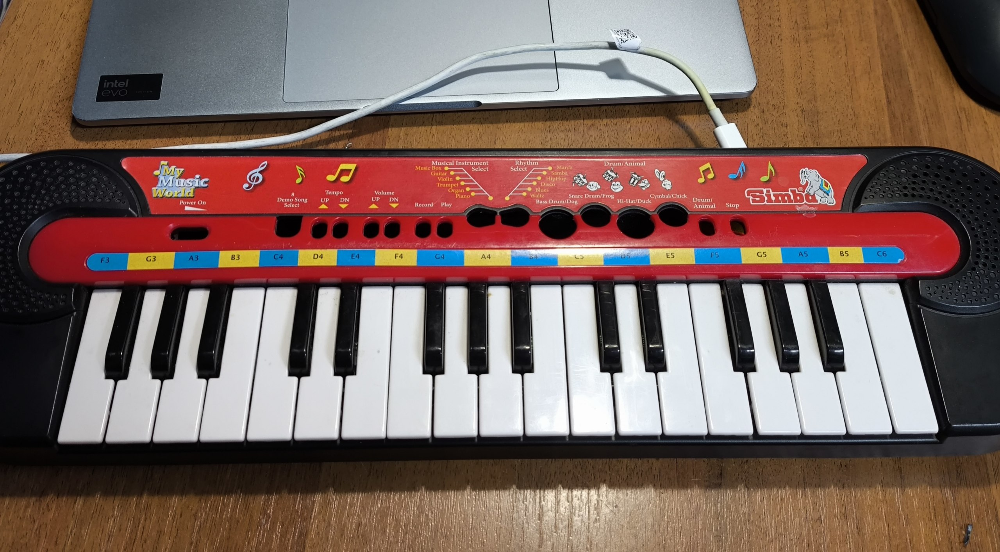
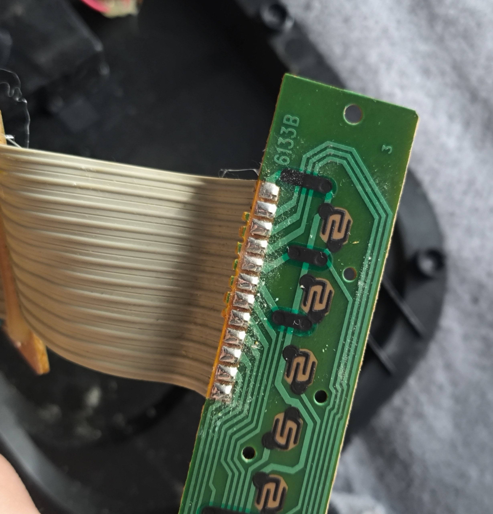
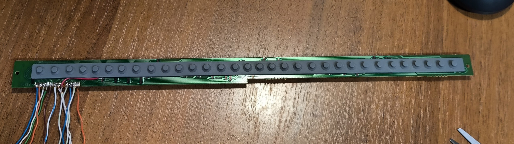
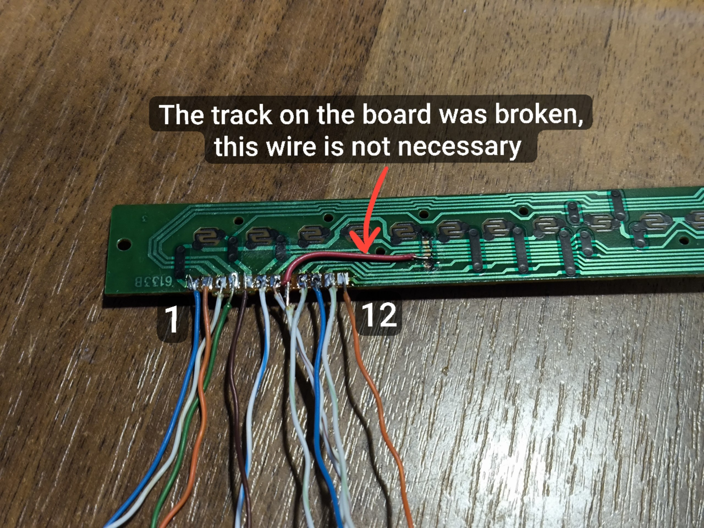

# MIDI-Simba 🎹⚡

Turn a toy **SIMBA** children's keyboard into a fully functional **USB MIDI controller** using an **Arduino Pro Micro**!

This project gives a second life to a toy synthesizer by interfacing its keyboard matrix directly with an Arduino Pro Micro board to communicate with any modern Digital Audio Workstation (DAW) over USB MIDI.

---

## 📸 Overview



## Assembly

You need this printed circuit board. Other parts u can remove




Remove the ribbon cable and replace it with separate wires.

It will look like this, first 4 is rows and other 8 columns:



Connect them to arduino to any digital pins.

Here is my table:

| Wire | Pin on Arduino Pro Micro |
| --- | --- |
| **1 (row 1)** | **2** |
| **2 (row 2)** | **3** |
| **3 (row 3)** | **4** |
| **4 (row 4)** | **5** |
| **5 (column 1)** | **7** |
| **6 (column 2)** | **6** |
| **7 (column 3)** | **8** |
| **8 (column 4)** | **9** |
| **9 (column 5)** | **10** |
| **10 (column 6)** | **16** |
| **11 (column 7)** | **14** |
| **12 (column 8)** | **15** |

After installation, send the code to Arduino board.


## 🗂 Ribbon Cable & Note Mapping

The keyboard uses a **4-row × 8-column** matrix (12 ribbon lines total). 

### Note Layout
The keyboard matrix covers a 32-note range starting from **C6** down to **F3**:

| wire | 5 | 6 | 7 | 8 | 9 | 10 | 11 | 12 |
| --- | --- | --- | --- | --- | --- | --- | --- | --- |
| **1** | c6 | b5 | a#5 | a5 | g#5 | g5 | f#5 | f5 |
| **2** | e5 | D#5 | D5 | and so on |  |  |  |  |
| **3** |  |  |  |  |  |  |  |  |
| **4** |  |  |  |  |  |  |  |  |


---

## 🎹 MIDI Note Matrix Table

Below is the 4x8 MIDI note map array corresponding to the matrix rows and columns:

```cpp
{
  {72, 71, 70, 69, 68, 67, 66, 65}, // Строка 1
  {64, 63, 62, 61, 60, 59, 58, 57}, // Строка 2
  {56, 55, 54, 53, 52, 51, 50, 49}, // Строка 3
  {48, 47, 46, 45, 44, 43, 42, 41}  // Строка 4
};
```

## ⚠️ Important Note: Ghosting / Phantom Key Presses

Due to the internal wiring and design of the original toy synthesizer keyboard matrix (which lacks isolation diodes for each key), **phantom key presses (ghosting) may occur when pressing more than 3 keys simultaneously**. 

This device works best for monophonic lines, chords less than 4 notes

---
